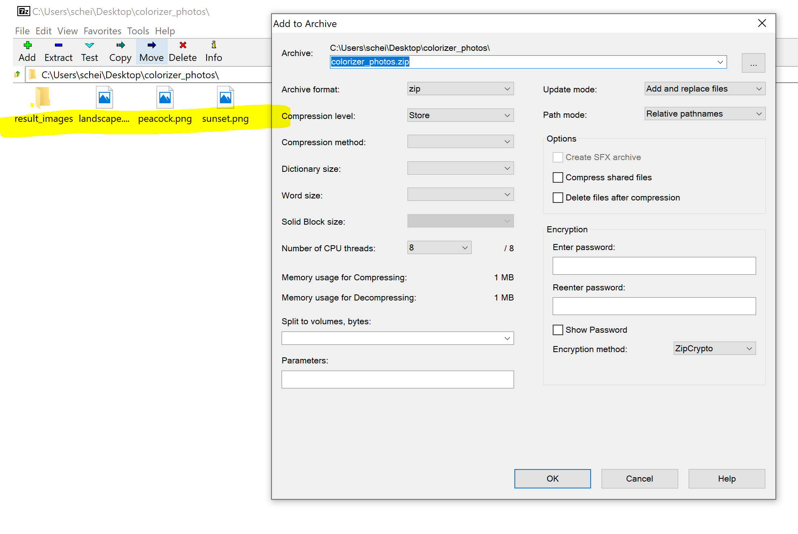

# batch_colorizer
A Google Colab program that automatically colorizes large amounts of black and white images.

# HOW TO USE
## Windows Only: Download 7zip
The colorizer requires a zip file containing an empty folder, and unfortunately Windows 10 automatically deletes empty folders in a zip file. The software 7zip overrides this.

* Windows 32-bit : https://www.7-zip.org/a/7z1900.exe
* Windows 64-bit : https://www.7-zip.org/a/7z1900-x64.exe

## Organize zips
Put all your black and white images into one directory, and make an empty folder in the directory titled "result_images". 

## Make zips
Windows: 
1. Open 7zip
2. Navigate to the directory with your images and the empty folder
3. Select all images and folder
4. Right click --> 7Zip --> Add to Archive
5. These settings can be changed to your liking if you want to compress the zip, but otherwise change the defaults to what is shown in the picture below.
6. Click OK.

## Make Google Drive folders
Make two new folders on your Google Drive, one where you will upload the black and white zip, and one which will end up with a colorized zip. Upload the zip file into the black and white folder.

## Define folder variables
In the Google Colab program, navigate down to the bottom of the script and enter in the ID of the black and white folder, the title of the black and white folder, and the title of the colorized folder. The ID of the black and white folder is the series of numbers and letters after the last slash in the URL of that folder.

## Run the program
On the top left of the Colab program, go to Runtime --> Run all and watch the magic! Just follow the prompts of the script from this point. If done correctly, all  
